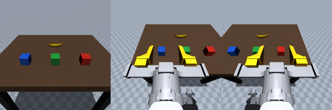

# HEI MuJoCo Sim

可复现的 HEI ReBot Lift 双臂 MuJoCo 仿真配置库。机器人模型、桌面物体、三路机载相机、碰撞摩擦、位置执行器和夹持修复都随仓库提供，克隆后不依赖原电脑、原项目目录或临时文件。



从左到右：机器人正面 `front`、左手腕 `left_wrist`、右手腕 `right_wrist`。外部总览 `overview` 供操作观察，不进入 observation。

## 克隆与安装

使用 Python **3.10、3.11 或 3.12**，推荐 3.10。基础依赖固定为 MuJoCo **3.5.0**、NumPy **2.2.6**；手柄采集额外固定 OpenCV 4.13.0.92、pynput 1.8.1 等。模型资源已完整提交，无需 Git LFS 或另行下载机器人仓库。

### Windows

在已有兼容 Python 的 PowerShell 中：

```powershell
git clone https://github.com/YouShouldBetOnMe/hei-mujoco-sim.git
cd hei-mujoco-sim
powershell -NoProfile -ExecutionPolicy Bypass -File .\scripts\setup.ps1

# 打开总览窗口
.\.venv\Scripts\python.exe -m hei_sim.portable --view

# 手柄采集；无手柄时自动使用键盘
powershell -NoProfile -ExecutionPolicy Bypass -File .\scripts\collect.ps1
```

如果默认 `python` 版本不符合要求，可传入解释器，例如：

```powershell
powershell -NoProfile -ExecutionPolicy Bypass -File .\scripts\setup.ps1 -Python 'C:\Python310\python.exe'
```

已有 Conda 的用户也可执行 `conda env create -f environment.yml`，再 `conda activate hei-mujoco-sim`，使用下面的 `hei-mujoco` / `hei-collect` 命令。

### Linux / WSL

```bash
git clone https://github.com/YouShouldBetOnMe/hei-mujoco-sim.git
cd hei-mujoco-sim
python3 -m venv .venv
source .venv/bin/activate
python -m pip install '.[teleop]'
python -m pip check
hei-mujoco --verify-files --check
hei-mujoco --view
```

Linux 图形库可通过 `sudo apt-get install libgl1 libegl1 libglfw3` 安装。无桌面的机器可设置 `MUJOCO_GL=egl`，运行离屏渲染检查；交互窗口和键盘需要桌面/X 服务。WSL 中的手柄可能需要 USB 转发，Windows 的 WinMM 手柄无需这一步。

只需要场景/API 时使用 `python -m pip install .`，无需安装 `[teleop]`。macOS 的交互窗口使用 `mjpython -m hei_sim.portable --view`；macOS 与实体手柄映射需要在对应机器验收。

## 验证配置一致

```bash
hei-mujoco --verify-files --check
hei-grasp-check
```

第一条检查资源 SHA-256、从模型实际读取的设置、物体落桌、物体碰撞、摩擦差异、机载相机跟随关系和三路 224×224 RGB 渲染。报告写入当前工作目录的 `outputs/portable_check`。第二条验证左右夹爪在重力下保持、抬起、释放，以及低摩擦/旧求解配置下的滑落对照。

无图形环境时用 `hei-mujoco --verify-files --physics-only`；这不会验证渲染是否可用。项目也配置了 GitHub Actions，在 Windows 和 Linux 上执行物理/夹持检查。

关键配置：

| 设置 | 默认值 |
|---|---|
| 引擎 / 物理步长 | MuJoCo 3.5.0 / 0.002 s |
| 控制与采集频率 | 10 Hz 仿真时间 |
| 相机 | `front`、`left_wrist`、`right_wrist`，224×224 RGB |
| 物体方块 | 边长 0.08 m，质量 0.12 kg |
| 香蕉 | YCB 011，质量 0.10 kg，单凸包碰撞近似 |
| 桌面 / 物体摩擦 | `[0.8, 0.01, 0.001]`：滑动、扭转、滚动 |
| 机器人表面摩擦 | `[1.0, 0.01, 0.001]` |
| 接触 | `condim=6`，启用网格多点接触 |
| 求解 | implicitfast、椭圆摩擦锥、impratio=10、NoSlip 5 次 |
| 底盘 | 固定；双臂、夹爪、升降可动 |

精确参数见 [scene_reference.json](hei_sim/scene_reference.json)。夹持依靠实际 `mj_step` 接触动力学。机器人自身碰撞暂时关闭，模型安装位置、质量/摩擦和执行器参数仍是待实机标定的仿真值。夹持回归初始化阶段把物体放入夹爪，不能代表完整任务策略的成功率。

“一样的配置”指相同模型资源、版本和参数，以及验证通过。不同操作系统、CPU/GPU、驱动和渲染后端可能产生浮点或图像差异，不保证逐像素或长时间物理轨迹完全一致。

## 作为 Python 库使用

从任意工作目录导入；模型资源从已安装的包中定位：

```python
from hei_sim import Environment, CAMERAS

env = Environment()
try:
    observation = env.observe()
    assert tuple(observation["images"]) == CAMERAS
    # observation: 同一时间戳的三路 RGB 与 18 维机器人状态
    action = env.target.copy()
    env.step(action)  # 18 维绝对位置目标，推进 0.1 s
finally:
    env.close()
```

`Environment(fixed_lift=-0.2)` 可以建立升降物理固定的变体；底盘始终固定。18 维状态/动作顺序见 [schema.py](hei_sim/schema.py)：右臂 6 关节 + 夹爪、左臂 6 关节 + 夹爪、底盘 3 个速度（零）、升降高度。关节为弧度、夹爪为两指总开口米、升降为米。真机单位/零位/归一化映射需要另行处理。

根目录还提供标准 [scene.xml](scene.xml)，供已有 MuJoCo 项目加载。保留相对资源结构，并用 `home` keyframe 初始化 `qpos` 和 `ctrl`。Windows 的中文路径建议使用 Python `Environment()` 入口，它自动建立内容寻址的 ASCII 模型缓存，不会引用原电脑的缓存。

## 手柄 / 键盘采集

```bash
hei-collect --input gamepad
hei-collect --input keyboard
hei-collect --monitor-gamepad 30
```

三路相机始终同步记录，保存前校验完整性；缺任何一路拒绝该帧。默认保存到当前目录 `datasets/hei_raw`；中断或丢弃片段为 `.partial`。

| 操作 | 默认 Xbox 手柄 | 键盘 |
|---|---|---|
| 允许运动 | 按住 LB，启动后先松开一次 | 按住空格 |
| 水平移动 | 左摇杆 | W/S、A/D |
| 手部整体升降 | LB + 右摇杆前后 | 空格 + R/F |
| 手腕俯仰 | LB + RB + 左摇杆前后 | 空格 + I/K |
| 机身升降 | LB + 十字键上下 | 空格 + PageUp/PageDown |
| 夹爪张开 / 收紧 | LB + Y / A | 空格 + Z/X |
| 切换左右手 | X | Tab |
| 录制 / 保存 / 丢弃 | Start / Back / B | F5 / F6 / F7 |
| 重置 / 切键盘 / 退出 | 使用键盘 | F8 / F9 / Esc |

升降初始在最高位，要先下降才能再次向上。实际手柄轴/按钮映射可能不同，用监视命令核对；自定义 JSON 可通过 `--gamepad-config 路径` 指定，默认配置在 [gamepad_config.json](hei_sim/gamepad_config.json)。键盘监听是全局的，切换软件前松开空格。

这里提供场景和示范采集；训练数据另通过下面的 Release 发布。模型权重、论文 PDF、CUDA 训练环境和真机驱动不在本仓库中。

## 已发布数据集

提供 **100 条随机布局的双臂方块抓取与堆叠示范**，共 51,940 帧、155,820 张正面/左右腕同步图像。包含原始记录和 LeRobot v3 格式，按示范保留 90/10 训练验证划分。示范来自程序专家，升降架物理固定在 -0.25 m。

数据保存于 [Stack100 Release](https://github.com/YouShouldBetOnMe/hei-mujoco-sim/releases/tag/dataset-stack100-v1)，下载器逐卷校验 SHA-256 并恢复完整目录：

```bash
python scripts/download_dataset.py                 # LeRobot 格式
python scripts/download_dataset.py --format raw    # 原始三路相机和物理轨迹
```

规格、来源、读取示例及校验报告见 [数据集说明](docs/datasets/README.md)。数据独立下载，普通 `git clone` 只获取仿真代码、模型资源和数据说明。

## 来源与许可

机器人模型与场景构建器来自 [lipengdong/hei-rebot-lift](https://github.com/lipengdong/hei-rebot-lift)，固定来源提交 `40674132257099656a26ee7fd11cb67f80f25658`，保留 Apache 2.0 许可。香蕉资源来自 YCB 011，按 CC BY 4.0 保留署名及来源，详见 [NOTICE](NOTICE) 和 [YCB 说明](licenses/YCB_BANANA_SOURCE.md)。

维护者更新配置后，应同步 `scene.xml`、参数快照和资源哈希，并重新运行检查。发布用的独立安装验证见 [validation.json](docs/validation.json)。
